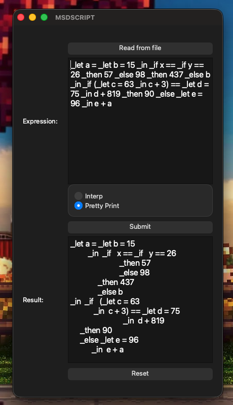

# msd-script

A lightweight mathematical scripting language, and a C++ interpreter for it, supporting integers, booleans, variable binding, conditional evaluation, and functions. Includes both a command-line interface and a Qt-based GUI. 

Documentation [here](https://jake-dame.github.io/msd-script/).

Built for macOS.

## Features

- Expression parsing with precedence for addition, multiplication, equality, and function calls
- Support for `let`, `if`, and lambda-style function expressions
- Recursive evaluation through an environment model (`Env`, `Val`, `Expr`)
- Expression-depth- and precedence-based pretty-printing
- Unit testing via Catch2; additional fuzz testing and differential testing, though those executables are not in this repo
- GUI frontend using QtWidgets for input, interpretation, and formatting

## Build

If you have Qt 6 or later, you can try the GUI. It was originally written for Qt5 but was updated for Qt 6 recently. Depending on where your Qt libraries are installed, you may not be able to use the Makefile. QT_PREFIX is on line 75 of the Makefile and might need to be adjusted accordingly.

Additionally, the fuzz/differential testing relies on binaries that are not in this repo, unless you want to make your own called `msdscript0`, then you probably shouldn't use that either.

I would suggest just using the CLI.

### Using Make

From the project root, you should be able to just run:

- `make interp`, `make print`, or any other corresponding program flag (see below)

to build, and run the interpreter in a given mode.

- `make test` runs unit tests

The program launches and ends if no option is given, so using `make all` or `make run` won't allow for expression input.

### CLI

1. Build
2. Run `./msd-script` in one of five modes:
   - `--help`: displays valid options for this program.
   - `--interp`: evaluates the expression if it can be evaluated
   - `--print`: prints the inputted expression with correct parentheses
   - `--pretty-print`: prints the inputted expression based on nested expression depth, with parentheses, extra whitespace, and newlines
   - `--test`: runs unit tests in `src/tests.cpp` (stored there and in `tests/unit/tests.cpp`, for various reasons)
3. Input your expression. Enter for newline.
4. `^D` to execute.
   
The program is currently set up to fail hard if it encounters invalid grammar or expressions... sorry.

Command-line flags include `--interp`, `--print`, and `--pretty-print`. Use `--help` for full options.

### GUI

Requires Qt 6 or later. Easiest is to just use CMakeLists.txt integration with Qt Creator. 

You can try running `make gui`, but it was based on the path at which my Qt libraries are installed relative to my home directory. You would need to troubleshoot either the Makefile or the CMakeLists.txt if linker errors occurred (probably due to not being able to find either any Qt library, or specifically the version I used).

## Project Structure

- [src/](src/)     <-- Core interpreter (language definition, parsing engine, etc.)
- [gui/](gui/)     <-- Qt GUI application
- [tests/](tests/) <-- Unit and fuzz tests (ignore these -- if you truly want to run tests, use the CLI above)
- [docs/](docs/)   <-- Doxygen documentation (Doxyfile only)
